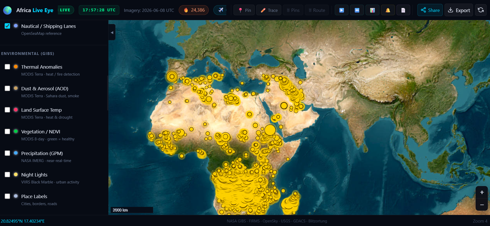

# Africa Live Eye

Real-time satellite monitoring platform for the African continent. Combines NASA GIBS imagery, live fire hotspots, lightning strikes, earthquakes, cyclones, and precipitation into a single dark-themed command-centre interface.



---

## Feature Overview

| Category | Feature | Data Source |
|---|---|---|
| **Imagery** | VIIRS 375m, MODIS Terra/Aqua 250m, Esri sub-meter | NASA GIBS |
| **Fire hotspots** | Live VIIRS active fire detections, refreshed every 3h | NASA FIRMS |
| **Lightning** | Real-time strikes (Blitzortung) or synthetic fallback | Blitzortung WS |
| **Earthquakes** | M2.5+ events, depth-coded colour rings | USGS GeoJSON |
| **Cyclones** | Active tropical storms with track lines | GDACS API |
| **Precipitation** | GPM IMERG 2 km rain-rate overlay | NASA GIBS |
| **Time animation** | Play through up to 30 days of imagery automatically | — |
| **Split-screen** | Compare two dates side-by-side with a draggable divider | — |
| **Analytics** | 7-day fire trend bar chart + earthquake magnitude doughnut | Chart.js |
| **Alert zones** | Draw a polygon, get browser notifications when events enter | Browser API |
| **PDF report** | Export map screenshot + data tables as landscape A4 PDF | jsPDF |
| **Live aircraft** | OpenSky Network transponder positions | OpenSky REST |
| **Locate Me** | Show your current GPS position on the map with a pulsing marker | Browser Geolocation API |

---

## Quick Start

```bash
# 1. Clone the repository
git clone https://github.com/TemiKayode/Africa-Live-Eye.git
cd Africa-Live-Eye

# 2. Install dependencies
npm install

# 3. Configure secrets
cp .env.example .env
# edit .env — add your FIRMS_API_KEY (and optionally MAPBOX_TOKEN)

# 4. Start the server
npm start
# Open http://localhost:3000
```

The app runs in **demo mode** without API keys — fire hotspots and lightning are synthesised from realistic Africa distributions so every feature works out of the box.

---

## Environment Variables

Copy `.env.example` to `.env` and fill in the values:

| Variable | Default | Description |
|---|---|---|
| `FIRMS_API_KEY` | *(empty)* | NASA FIRMS MAP_KEY — enables live fire detections. Without it, demo fires are generated. |
| `MAPBOX_TOKEN` | *(empty)* | Mapbox access token — unlocks Maxar 30–50 cm imagery at zoom 22. |
| `PORT` | `3000` | HTTP port the server listens on. |
| `FIRE_UPDATE_INTERVAL_MS` | `10800000` | FIRMS poll interval (ms). Default = 3 hours. |

**Security note:** All API keys are read exclusively on the server and never exposed to the browser. FIRMS data is proxied through `/api/fires`; Mapbox tiles use a token scoped server-side only.

### Getting free API keys

**NASA FIRMS**
1. Go to <https://firms.modaps.eosdis.nasa.gov/api/map_key/>
2. Sign in / create a free NASA Earthdata account
3. Copy the MAP_KEY into `.env`

**Mapbox**
1. Sign up at <https://mapbox.com>
2. Account → Access tokens → Create a token (free tier: 50 k map loads/month)
3. Paste into `.env` as `MAPBOX_TOKEN`

---

## Architecture

```
Birdeye/
├── server.js                   Express + Socket.IO backend
├── .env                        Secrets (never committed)
├── .env.example                Template for secrets
├── package.json
└── public/
    ├── index.html              Single-page UI
    ├── css/
    │   └── style.css           Dark space-themed design (~900 lines)
    └── js/
        ├── app.js              Core: map init, date slider, socket handlers, overlay toggling
        └── modules/
            ├── overlays.js     Lightning, earthquake, cyclone, precipitation layer groups
            ├── animation.js    Time-lapse play/stop/speed/span controls
            ├── splitscreen.js  Dual-map sync with draggable pixel divider
            ├── analytics.js    Chart.js fire trend + earthquake charts
            ├── alerts.js       Polygon draw, point-in-polygon, browser notifications
            └── report.js       jsPDF landscape A4 PDF with map screenshot + tables
```

### Data flow

```
Browser                  server.js                 External APIs
──────────────────────   ──────────────────────    ──────────────────
Socket.IO connect    →   emit fire-data            ← NASA FIRMS CSV
                         emit aircraft-data         ← OpenSky REST
                         emit earthquake-data       ← USGS GeoJSON
                         emit cyclone-data          ← GDACS API
                         emit lightning-history     ← Blitzortung WS
                                                        (or synthetic)
Socket.IO on tick    →   broadcast lightning-strike every 1–3 s
GET /api/fires       →   NodeCache → FIRMS → demo fallback
GET /api/earthquakes →   NodeCache → USGS
GET /api/cyclones    →   NodeCache → GDACS
GET /api/analytics/fires → 7-day bucketed fire counts
GIBS tile requests   →   served directly from NASA CDN (no proxy)
```

---

## Using the Interface

### Toolbar (top bar)

| Button | Action |
|---|---|
| 🎯 Locate Me | Centre map on your GPS position; drops a pulsing blue marker |
| 📍 Pin | Drop a draggable location pin (shareable link) |
| ✏️ Trace | Draw a route and measure distance |
| ▶️ Animate | Toggle time animation bar |
| ↔️ Compare | Toggle split-screen date comparison |
| 📊 Analytics | Open analytics sidebar (7-day trends) |
| 🔔 Alerts | Open alert zones panel |
| 📄 Report | Open PDF report modal |

### Date slider

Drag left for older imagery (up to 7 days back) or snap to **Today** with the cyan Today button. The live UTC clock in the topbar shows current time so you always know where "now" is.

### Time animation

1. Click the film icon to reveal the animation bar
2. Choose a day span (7 / 14 / 30 days) and frame speed
3. Press Play — imagery steps through each date automatically

### Split-screen comparison

1. Click the split icon — the map divides at the midpoint
2. Drag the vertical divider left/right
3. Set a comparison date for the right pane using the date input
4. Both maps pan/zoom in sync

### Alert zones

1. Open the Alerts panel
2. Click **Draw Zone** and click the map to place polygon vertices; double-click to close
3. Name the zone and save
4. The app checks every new fire/earthquake batch — browser notification fires if an event falls inside the polygon (10-minute debounce per zone per event type)

### PDF report

Open the report modal, review the summary stats, then click **Generate PDF**. The export captures a map screenshot (html2canvas) and writes data tables for fires, earthquakes, and aircraft into a landscape A4 document.

---

## Imagery Sources

| Layer | Resolution | Latency | Key required |
|---|---|---|---|
| NASA VIIRS SNPP True Color | 375 m | Daily | No |
| NASA MODIS Terra True Color | 250 m | Daily | No |
| NASA MODIS Aqua True Color | 250 m | Daily | No |
| NASA GPM IMERG Precipitation | 2 km | ~30 min | No |
| Esri World Imagery | < 1 m (urban) | Static | No |
| Mapbox Maxar Satellite | 30–50 cm | Recent | Yes |

---

## Live Data Sources

| Feed | Update rate | Fallback |
|---|---|---|
| NASA FIRMS fire hotspots | Every 3 hours | Synthetic demo fires |
| USGS earthquakes (M2.5+) | Every 5 minutes | Empty |
| Blitzortung lightning | Real-time WebSocket | Synthetic strikes every 1–3 s |
| OpenSky aircraft | Every 45 seconds | Empty |
| GDACS cyclones | Every 30 minutes | Empty |

---

## Session Logging

The server writes a `user_sessions.log` file (one JSON object per line) that records:

| Field | Description |
|---|---|
| `event` | `connect` / `locate` / `disconnect` |
| `ip` | Visitor IP address |
| `ts` | ISO 8601 timestamp |
| `lat`, `lon` | GPS coordinates (only present for `locate` events, when user clicks **Locate Me**) |
| `accuracy` | GPS accuracy in metres |
| `ua` | Browser user-agent string |

`user_sessions.log` is excluded from git via `.gitignore`. Users are only located when they explicitly click the **Locate Me** button — no passive tracking.

---

## Deployment

### Render.com (recommended — supports WebSockets)

1. Push to GitHub
2. Render → **New → Web Service** → connect the repo
3. Build command: `npm install`
4. Start command: `npm start`
5. Add environment variables: `FIRMS_API_KEY`, `MAPBOX_TOKEN` (optional)
6. Deploy — Render provides a free public HTTPS URL with persistent WebSocket support

### Railway / Fly.io

Both support persistent Node processes and WebSockets. Set the same environment variables and point the start command at `npm start`.

### Docker

```dockerfile
# Dockerfile (create at project root)
FROM node:20-alpine
WORKDIR /app
COPY package*.json ./
RUN npm ci --omit=dev
COPY . .
EXPOSE 3000
CMD ["node", "server.js"]
```

```bash
docker build -t africa-live-eye .
docker run -p 3000:3000 --env-file .env africa-live-eye
```

### Vercel / Netlify (not recommended)

These platforms are serverless — they do not support persistent WebSocket connections. The frontend will load but live updates (fires, lightning, aircraft) will not work.

---

## CDN Dependencies (loaded in index.html)

| Library | Version | Purpose |
|---|---|---|
| Leaflet | 1.9.4 | Interactive map core |
| Socket.IO client | 4.x | Real-time server push |
| Chart.js | 4.4.2 | Analytics charts |
| jsPDF | 2.5.1 | PDF generation |
| jsPDF-AutoTable | 3.8.2 | Table plugin for jsPDF |
| html2canvas | 1.4.1 | Map screenshot for PDF |

---

## License

MIT
